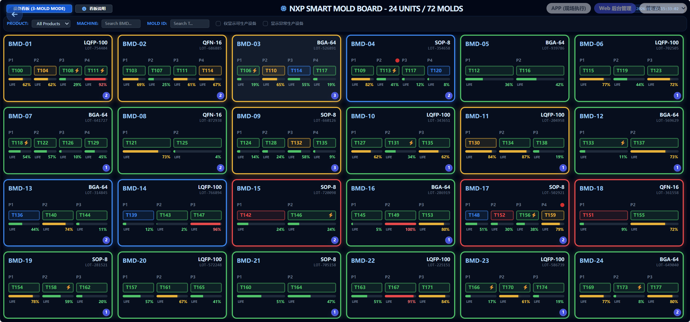

# SmartMold 设备生产看板 API 接口需求文档

## 页面原型参考

*(注：请确保 dashboard_prototype.png 文件存放在文档同级目录下)*

本文档定义了“设备生产看板 (主入口)”页面（Admin 端）所需的数据接口及其数据结构。

## 1. 核心数据接口

### 1.1 获取所有设备实时状态列表
*   **用途**: 渲染看板主界面，展示全厂 24 台设备（BMD-01 ~ BMD-24）的状态。
*   **接口**: `POST /api/admin/dashboard/machines/status`
*   **请求体**:
    ```json
    {
      "floor": "1F",          // 可选, 按楼层筛选
      "onlyAlerts": false     // 可选, true (仅显示异常/预警设备)
    }
    ```
*   **返回数据**:
    ```json
    {
      "machines": [
        {
          "machineId": "BMD-01",
          "status": "NORMAL", // NORMAL, MAINTENANCE_DUE, OVERDUE, BUYOFF, DISABLED, OFFLINE
          "moldCount": 4,      // 2, 3 或 4 模模式
          "molds": [
            {
              "moldId": "MOLD-001",
              "shortName": "QFN-64",
              "currentShots": 450000,
              "maxShots": 500000,
              "healthScore": 90,
              "status": "RUNNING"
            },
            {
              "moldId": "MOLD-002",
              "shortName": "QFN-32",
              "currentShots": 495000,
              "maxShots": 500000,
              "healthScore": 10,
              "status": "MAINTENANCE_DUE"
            }
          ],
          "pendingTasks": 2    // 该设备下的待办任务数
        }
      ],
      "summary": {
        "total": 24,
        "normal": 18,
        "warning": 4,
        "critical": 2
      }
    }
    ```

### 1.2 获取所有机台详细待办清单
*   **用途**: 获取当前所有可用设备的待办任务列表（如：需保养、维修、验证等）。
*   **接口**: `POST /api/admin/dashboard/all-machines/tasks`
*   **请求体**:
    ```json
    {
      "floor": "1F",          // 可选, 按楼层筛选
      "urgency": "HIGH"       // 可选, 按紧急程度筛选
    }
    ```
*   **返回数据**:
    ```json
    [
      {
        "taskId": "TASK-1001",
        "machineId": "BMD-01",
        "type": "MAINTENANCE", // MAINTENANCE, REPAIR, REPLACE, VERIFY
        "moldId": "MOLD-002",
        "description": "模具冲次接近上限，需进行二级保养",
        "createdAt": "2026-02-26 08:00:00",
        "urgency": "HIGH"
      },
      {
        "taskId": "TASK-1002",
        "machineId": "BMD-03",
        "type": "REPAIR",
        "moldId": "MOLD-045",
        "description": "反馈模具压合不紧，需检查密封圈",
        "createdAt": "2026-02-26 09:15:00",
        "urgency": "MEDIUM"
      }
    ]
    ```

### 1.3 获取当前用户角色与权限
*   **用途**: 在看板或管理端初始化时，获取当前登录用户的角色及可操作权限，用于前端按钮显隐控制。
*   **接口**: `POST /api/admin/auth/permissions`
*   **请求体**:
    ```json
    {}
    ```
*   **返回数据**:
    ```json
    {
      "userId": "U12345",
      "username": "admin_zhang",
      "role": "管理员", // 管理员, 大材料工程师, 小材料工程师, 带班, 操作员
      "permissions": [
        "MOLD_EDIT",       // 模具信息编辑
        "MOLD_DELETE",     // 模具删除
        "TASK_COMPLETE",   // 确认完成待办
        "SPARE_MANAGE",    // 备件库存管理
        "USER_MANAGE",     // 用户管理权限
        "PREDICTION_VIEW"  // 查看购买预测
      ],
      "department": "模具部"
    }
    ```

---

## 2. 交互操作接口

### 2.1 确认完成待办任务
*   **用途**: 在待办清单弹窗中，点击“确认完成”按钮。
*   **接口**: `POST /api/admin/dashboard/task/complete`
*   **请求体**:
    ```json
    {
      "taskId": "TASK-1001",
      "operator": "张三",
      "remark": "已完成清洁与润滑"
    }
    ```
*   **返回数据**: `200 OK`

### 2.2 模具停用/启用操作
*   **用途**: 在看板详情或后台管理中对模具进行状态切换。
*   **接口**: `POST /api/admin/dashboard/mold/toggle-status`
*   **请求体**:
    ```json
    {
      "moldId": "MOLD-001",
      "action": "DISABLE", // DISABLE 或 ENABLE
      "reason": "模具损坏严重，申请报废"
    }
    ```
*   **返回数据**: `200 OK`

---

## 3. 统计与说明接口

### 3.1 获取看板状态定义说明
*   **用途**: 渲染“看板说明”弹窗，解释颜色、图标及进度条含义。
*   **接口**: `POST /api/admin/dashboard/config/legends`
*   **返回数据**:
    ```json
    [
      {
        "color": "green",
        "label": "正常生产",
        "description": "模具冲次处于安全范围内（<70%）"
      },
      {
        "color": "yellow",
        "label": "即将保养",
        "description": "模具冲次已达到预警阈值（70%-90%）"
      }
    ]
    ```

---

**说明**: 
1. 所有接口统一采用 `POST` 形式。
2. 实时状态数据建议后端配合 Redis 或其他缓存机制，以支持高频刷新需求。
3. 状态颜色逻辑由后端根据模具冲次百分比（健康度）实时计算并返回，前端仅负责 UI 渲染。
